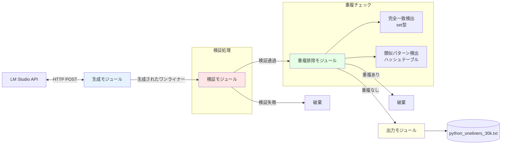
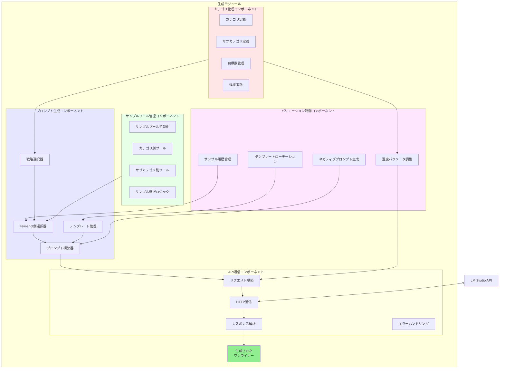
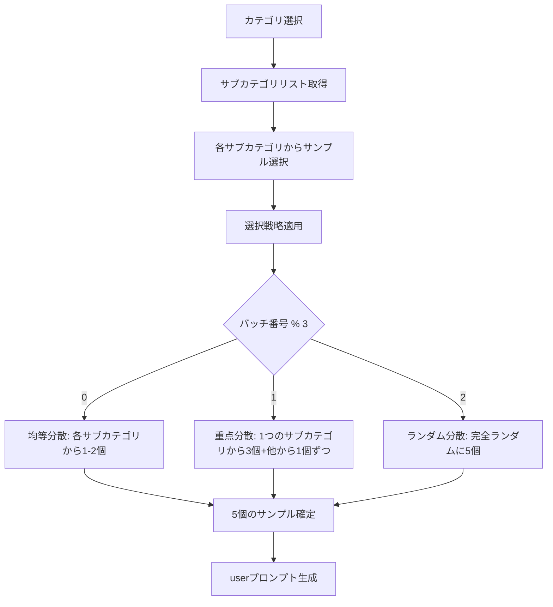
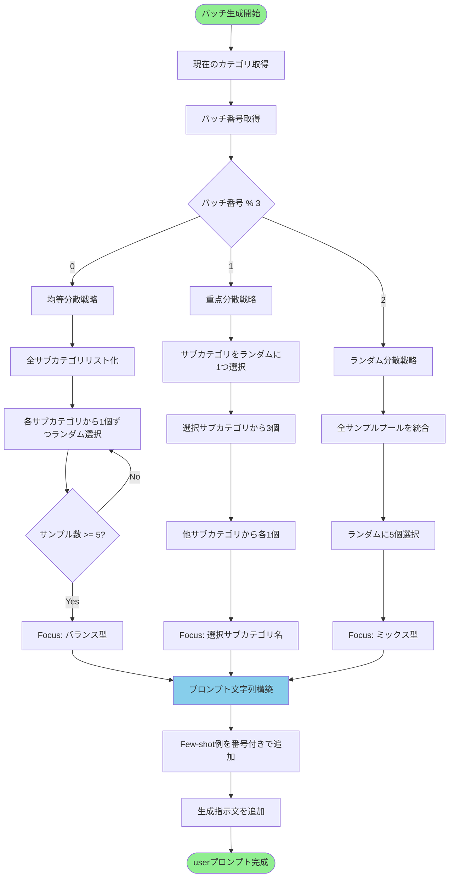
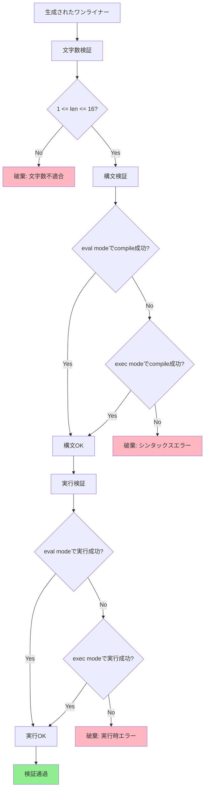
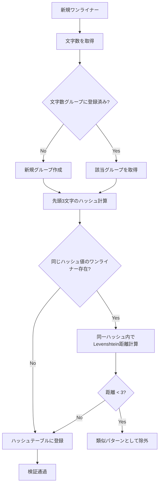
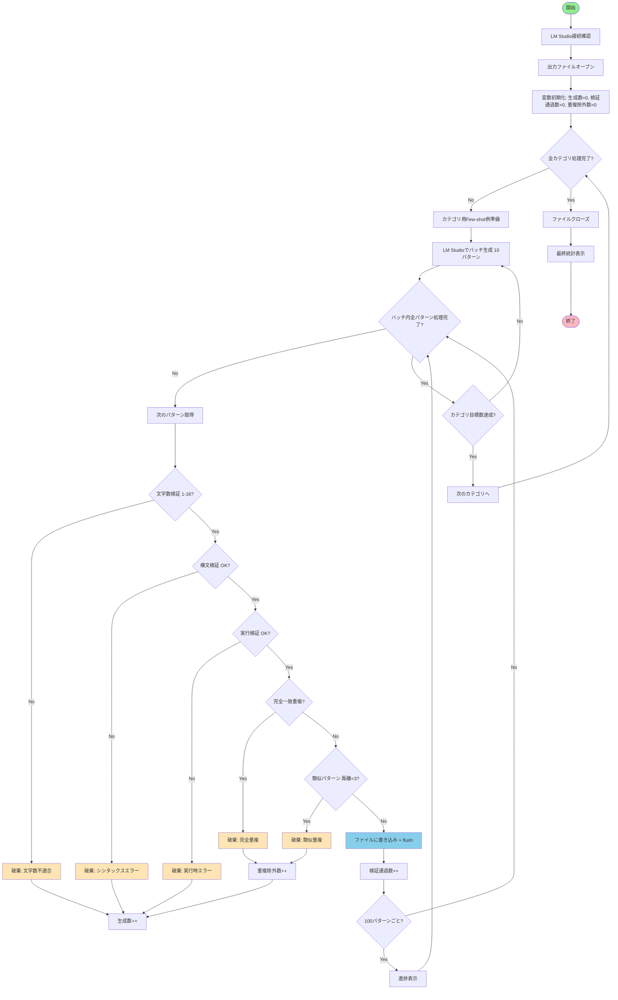

# 16文字Pythonワンライナー生成システム 仕様書

## 1. 概要

LM Studioを使用して、意味のある16文字以下のPythonワンライナーを30,000パターン生成し、テキストファイルに出力するシステム。

## 2. 目的

- Pythonの言語仕様と標準ライブラリの機能を網羅したワンライナーを生成
- 教育目的、コードゴルフ、言語モデルの評価に使用可能なデータセット作成
- Python REPLで即座に実行可能な実用的コードスニペット集

## 3. 制約条件

### 3.1 文字数制約
- 16文字以下（1文字以上16文字以内）
- ASCII文字は1バイト1文字、マルチバイト文字も1文字としてカウント
- 改行文字、タブ文字は含まない
- 先頭・末尾の空白も文字数に含む

### 3.2 実行可能性
- Python REPL（対話モード）で実行可能であること
- 式（expression）として評価可能、または文（statement）として実行可能であること
- シンタックスエラーが発生しないこと
- 実行時エラーを起こさないこと

### 3.3 意味のある要件
以下のいずれかを満たすこと：
1. 数値や文字列などの値を返す
2. データ構造を生成する
3. 標準ライブラリの機能を使用する

## 4. カバーすべきPython機能

### 4.1 基本データ型
- 整数リテラル（10進数、16進数）
- 浮動小数点数リテラル
- 複素数リテラル
- 文字列リテラル（シングルクォート、ダブルクォート）
- ブールリテラル（True、False）
- Noneリテラル

### 4.2 データ構造
- リストリテラル（要素の列挙、内包表記、range展開）
- タプルリテラル（括弧付き、括弧なし）
- 辞書リテラル（キーと値のペア）
- セットリテラル

### 4.3 演算子
- 算術演算子（加算、減算、乗算、除算、整数除算、剰余、べき乗）
- 比較演算子（等価、不等価、大小比較）
- 論理演算子（and、or、not）
- ビット演算子（AND、OR、XOR、NOT、左シフト、右シフト）

### 4.4 制御構造
- リスト内包表記
- 辞書内包表記
- セット内包表記
- 三項演算子
- ジェネレータ式

### 4.5 組み込み関数
16文字制約下で使用可能な組み込み関数：
- len: 長さを返す
- sum: 合計を返す
- max: 最大値を返す
- min: 最小値を返す
- abs: 絶対値を返す
- int: 整数に変換
- str: 文字列に変換
- list: リストに変換
- tuple: タプルに変換
- sorted: ソートされたリストを返す
- reversed: 逆順イテレータを返す
- enumerate: インデックス付きイテレータを返す
- zip: 複数イテラブルを結合
- map: 関数を適用
- filter: 条件でフィルタリング
- all: 全てTrueか判定
- any: いずれかTrueか判定

### 4.6 標準ライブラリ
16文字制約下で使用可能な短いモジュール名：
- os: オペレーティングシステムインタフェース
- re: 正規表現
- sys: システム固有のパラメータと関数
- math: 数学関数
- gc: ガベージコレクタ

### 4.7 文字列操作
- upper、lowerメソッドによる大文字小文字変換
- 文字列の乗算による繰り返し
- splitメソッドによる分割
- joinメソッドによる結合
- インデックスアクセス
- スライス操作

### 4.8 数学・計算
- べき乗計算
- 複数項の加算
- 整数除算と剰余の組み合わせ
- round関数による丸め
- pow関数によるべき乗計算

## 5. 生成戦略

### 5.1 カテゴリ別生成配分
生成を以下の7カテゴリに分類し、目標数を設定：

1. **数値計算** (5,000パターン)
   - 算術演算、べき乗、ビット演算、数学関数を含むワンライナー

2. **文字列操作** (5,000パターン)
   - スライス、メソッド、フォーマット、結合を含むワンライナー

3. **データ構造** (5,000パターン)
   - リスト、辞書、セット、タプルの操作を含むワンライナー

4. **内包表記** (5,000パターン)
   - リスト内包表記、辞書内包表記、セット内包表記を含むワンライナー

5. **組み込み関数** (5,000パターン)
   - len, sum, max, min, sorted, map, filter等を含むワンライナー

6. **標準ライブラリ** (3,000パターン)
   - math, os, sys, re, gc等のimportを含むワンライナー

7. **その他・応用** (2,000パターン)
   - 複数カテゴリを組み合わせた複合パターン

### 5.2 システムプロンプト（英語）
```
You are a Python expert. Generate meaningful Python one-liners with 16 characters or fewer.

Requirements:
- 16 characters or less (1-16 characters)
- Executable in Python REPL
- No syntax errors
- Returns a value or has side effects
- Creative and diverse patterns

Avoid:
- Code that causes errors
- Meaningless character strings
- Duplicate or similar patterns
```

### 5.3 システムプロンプト（日本語逐語訳）
```
あなたはPythonの専門家です。16文字以下の意味のあるPythonワンライナーを生成してください。

要件：
- 16文字以下（1-16文字）
- Python REPLで実行可能
- シンタックスエラーなし
- 値を返すか副作用を持つ
- 創造的で多様なパターン

避けること：
- エラーを引き起こすコード
- 意味のない文字列
- 重複または類似のパターン
```

## 6. 実装設計

### 6.1 システム全体構成

#### 6.1.1 トップレベルアーキテクチャ



システムは以下の4つのモジュールから構成される：

1. **生成モジュール**: LM Studioと通信しワンライナーを生成
2. **検証モジュール**: 生成されたワンライナーの妥当性を検証
3. **重複排除モジュール**: 重複および類似パターンを検出・除外
4. **出力モジュール**: 検証済みワンライナーをファイルに出力

#### 6.1.2 生成モジュールの内部構成



**各コンポーネントの役割**：

**1. カテゴリ管理コンポーネント**
- カテゴリとサブカテゴリの定義を保持
- 各カテゴリの目標パターン数を管理
- 現在の生成進捗を追跡
- 次に生成すべきカテゴリを決定

**2. サンプルプール管理コンポーネント**
- 各カテゴリ50-100個のサンプルを事前定義
- サブカテゴリごとに10-20個のサンプルを分類
- カテゴリとサブカテゴリに応じたサンプル抽出
- サンプルの検証とフィルタリング

**3. プロンプト生成コンポーネント**
- バッチ番号に基づく戦略選択（均等/重点/ランダム）
- 戦略に従ったFew-shot例の選択
- カテゴリ別プロンプトテンプレートの管理
- システムプロンプトとuserプロンプトの構築

**4. バリエーション制御コンポーネント**
- 過去3バッチのサンプル履歴を管理
- 生成数に応じた温度パラメータの動的調整
- 最近20パターンからネガティブプロンプトを生成
- 100バッチごとのテンプレート表現ローテーション

**5. API通信コンポーネント**
- LM Studio APIへのHTTPリクエスト構築
- POST通信の実行とタイムアウト管理
- JSONレスポンスの解析とワンライナー抽出
- 接続エラー、HTTPエラー、パースエラーのハンドリング

**コンポーネント間の主要なデータフロー**：

1. カテゴリ管理 → プロンプト生成: 現在のカテゴリ情報
2. カテゴリ管理 → バリエーション制御: 生成進捗数
3. サンプルプール → プロンプト生成: 候補サンプル群
4. バリエーション制御 → プロンプト生成: 除外サンプルリスト
5. プロンプト生成 → API通信: 完成したプロンプト
6. バリエーション制御 → API通信: 温度パラメータ
7. API通信 → 出力: 生成されたワンライナー配列

### 6.2 生成モジュール設計

#### 6.2.1 LM Studio API連携
- エンドポイント: http://localhost:1234/v1/chat/completions
- HTTPメソッド: POST
- Content-Type: application/json
- リクエストボディに以下を含める：
  - model: 使用するモデルの識別子
  - messages: systemロールとuserロールのメッセージ配列
  - temperature: 0.8（多様性を確保）
  - max_tokens: 100
  - n: 10（一度に10パターン生成）

#### 6.2.2 カテゴリ別サブカテゴリ定義

各メインカテゴリを複数のサブカテゴリに分割し、多様なパターン生成を実現：

**1. 数値計算（5,000パターン）**
- サブカテゴリ：
  - 算術演算（加算、減算、乗算、除算、剰余）
  - べき乗計算（2のべき乗、小さい数のべき乗）
  - ビット演算（AND、OR、XOR、シフト）
  - 複素数計算
  - 16進数・8進数リテラル

**2. 文字列操作（5,000パターン）**
- サブカテゴリ：
  - 大文字小文字変換（upper、lower、capitalize）
  - 文字列繰り返し（乗算）
  - スライス操作（先頭、末尾、範囲）
  - split/join操作
  - 文字列インデックスアクセス

**3. データ構造（5,000パターン）**
- サブカテゴリ：
  - リストリテラル（要素列挙、range展開）
  - タプルリテラル（括弧付き、括弧なし）
  - 辞書リテラル（整数キー、文字列キー）
  - セットリテラル
  - ネストした構造

**4. 内包表記（5,000パターン）**
- サブカテゴリ：
  - リスト内包表記（単純、条件付き）
  - 辞書内包表記
  - セット内包表記
  - ジェネレータ式
  - 三項演算子

**5. 組み込み関数（5,000パターン）**
- サブカテゴリ：
  - 集約関数（len、sum、max、min）
  - 型変換関数（int、str、list、tuple）
  - ソート関数（sorted、reversed）
  - イテレータ関数（enumerate、zip、map、filter）
  - 述語関数（all、any）

**6. 標準ライブラリ（3,000パターン）**
- サブカテゴリ：
  - import文（os、sys、re、math、gc）
  - __import__関数
  - 複合文（import後に式）

**7. その他・応用（2,000パターン）**
- サブカテゴリ：
  - 複数演算子の組み合わせ
  - 複数関数のネスト
  - データ構造と関数の組み合わせ

#### 6.2.3 Few-shotサンプルプール設計



各カテゴリのサンプルプール構成：

**サンプルプールの構造**：
- カテゴリごとに50-100個の典型的ワンライナーを事前定義
- サブカテゴリごとに10-20個を配分
- サンプルは16文字以下で検証済みのもののみ登録

**サンプル選択戦略**（バッチごとにローテーション）：
1. **均等分散戦略**: 全サブカテゴリから均等に選択
2. **重点分散戦略**: 1つのサブカテゴリに重点を置く
3. **ランダム分散戦略**: 完全ランダムに選択

選択手順：
1. 現在のバッチ番号を3で割った余りで戦略を決定
2. 戦略に従ってサブカテゴリを選択
3. 各サブカテゴリからランダムにサンプルを抽出
4. 合計5個のFew-shot例を確定

#### 6.2.4 プロンプトテンプレート設計

**基本構造**：
```
Category: {カテゴリ名}
Focus: {サブカテゴリ指定}

Examples (16 characters or less):
1. {サンプル1}
2. {サンプル2}
3. {サンプル3}
4. {サンプル4}
5. {サンプル5}

Generate 10 more diverse Python one-liners in this category.
Requirements: 16 characters or less, executable, meaningful.
Vary the patterns and avoid duplicating the examples.
```

**カテゴリ別テンプレートバリエーション**：

1. **数値計算カテゴリ**：
```
Category: Numeric Computation
Focus: {arithmetic|power|bitwise|complex}

Examples:
...

Generate 10 diverse numeric computation one-liners.
Use different operators and number combinations.
```

2. **文字列操作カテゴリ**：
```
Category: String Manipulation
Focus: {case_conversion|repetition|slicing|split_join}

Examples:
...

Generate 10 diverse string manipulation one-liners.
Use different string methods and patterns.
```

3. **データ構造カテゴリ**：
```
Category: Data Structures
Focus: {list|tuple|dict|set}

Examples:
...

Generate 10 diverse data structure one-liners.
Use different literal syntaxes and nesting patterns.
```

4. **内包表記カテゴリ**：
```
Category: Comprehensions
Focus: {list_comp|dict_comp|set_comp|generator}

Examples:
...

Generate 10 diverse comprehension one-liners.
Use different iteration patterns and conditions.
```

5. **組み込み関数カテゴリ**：
```
Category: Built-in Functions
Focus: {aggregation|conversion|sorting|iteration}

Examples:
...

Generate 10 diverse built-in function one-liners.
Use different functions and argument patterns.
```

6. **標準ライブラリカテゴリ**：
```
Category: Standard Library
Focus: {os|sys|math|re|gc}

Examples:
...

Generate 10 diverse import statement one-liners.
Use different modules and import patterns.
```

7. **その他・応用カテゴリ**：
```
Category: Advanced Patterns
Focus: {combination|nesting|complex}

Examples:
...

Generate 10 diverse advanced pattern one-liners.
Combine multiple concepts creatively.
```

#### 6.2.5 プロンプト生成アルゴリズム



**詳細手順**：

1. **戦略選択**
   - バッチ番号を3で割った余りで戦略を決定
   - 0: 均等分散、1: 重点分散、2: ランダム分散

2. **均等分散戦略（バッチ番号 % 3 == 0）**
   - 現在カテゴリの全サブカテゴリをリスト化
   - 各サブカテゴリのサンプルプールから1個ずつランダム選択
   - サブカテゴリ数が5未満の場合は重複サブカテゴリから追加選択
   - サブカテゴリ数が5を超える場合はランダムに5個のサブカテゴリを選択
   - Focus: "balanced across {サブカテゴリ名列挙}"

3. **重点分散戦略（バッチ番号 % 3 == 1）**
   - サブカテゴリをランダムに1つ選択（重点サブカテゴリ）
   - 重点サブカテゴリから3個をランダム選択
   - 他のサブカテゴリから各1個ずつ選択（合計2個）
   - Focus: "{重点サブカテゴリ名}-focused"

4. **ランダム分散戦略（バッチ番号 % 3 == 2）**
   - 現在カテゴリの全サンプルプールを統合
   - サブカテゴリを考慮せず完全ランダムに5個選択
   - Focus: "mixed patterns"

5. **プロンプト文字列構築**
   - テンプレートにカテゴリ名を埋め込み
   - Focus行にフォーカス情報を埋め込み
   - 選択した5個のサンプルを番号付きリストで追加
   - 生成指示文を追加
   - 最終的なuserプロンプト文字列を返す

#### 6.2.6 サブカテゴリ組み合わせロジック

**目的**: 同じカテゴリ内でも異なるサブカテゴリを組み合わせてバリエーションを確保

**組み合わせパターン**：

1. **単一サブカテゴリ集中型**（30%）
   - 1つのサブカテゴリに絞った生成
   - 深い探索によりマイナーパターンも発見
   - 例: 「ビット演算のみ」「リスト内包表記のみ」

2. **複数サブカテゴリ均等型**（50%）
   - 複数サブカテゴリを均等に混合
   - 広い探索により多様なパターンを生成
   - 例: 「算術演算+べき乗+ビット演算」

3. **クロスカテゴリ型**（20%）
   - 異なるメインカテゴリの要素を組み合わせ
   - 応用カテゴリでのみ使用
   - 例: 「文字列操作+組み込み関数」「データ構造+内包表記」

**組み合わせ選択アルゴリズム**：
1. バッチ番号を10で割った余りで組み合わせタイプを決定
2. 0-2: 単一サブカテゴリ集中型
3. 3-7: 複数サブカテゴリ均等型
4. 8-9: クロスカテゴリ型（応用カテゴリのみ、他は均等型に置換）

#### 6.2.7 バリエーション確保戦略

**課題**: 同じカテゴリで繰り返し生成すると似たパターンが増加

**対策**：

1. **バッチごとのFew-shot例ローテーション**
   - 前バッチで使用したサンプルは次バッチで除外
   - 除外リストは過去3バッチ分を保持
   - これにより15個（3バッチ×5個）のサンプルが常に除外

2. **サブカテゴリローテーション**
   - 重点分散戦略で選択するサブカテゴリを記録
   - 同じサブカテゴリが連続3回重点にならないよう制御
   - ローテーションにより全サブカテゴリに均等に重点が当たる

3. **温度パラメータ調整**
   - 基本temperature: 0.8
   - 同じカテゴリで500パターン生成後: 0.85に上昇
   - 同じカテゴリで1000パターン生成後: 0.9に上昇
   - 多様性を段階的に強化

4. **ネガティブプロンプト追加**
   - 最近生成された20パターンをプロンプトに追加
   - "Avoid generating patterns similar to these recent ones:"
   - LLMが意図的に異なるパターンを生成するよう誘導

5. **定期的なプロンプトリフレッシュ**
   - 100バッチごとにプロンプトテンプレートの表現を変更
   - "Generate" → "Create" → "Produce" などの動詞を変更
   - 些細な変更でもLLMの出力パターンが変わることを利用

### 6.3 検証モジュール設計



#### 6.3.1 文字数検証
- len関数で文字数をカウント
- 1文字以上16文字以下であることを確認
- 条件を満たさない場合は破棄

#### 6.3.2 構文検証
- compile関数でバイトコードへのコンパイルを試行
- まずeval modeでコンパイルを試行
- eval modeで失敗した場合はexec modeで試行
- 両方失敗した場合はシンタックスエラーとして破棄

#### 6.3.3 実行検証
- サンドボックス環境で実際に実行を試行
- __builtins__を空辞書に設定しセキュリティを確保
- タイムアウトを1秒に設定し無限ループを防止
- 実行時エラーが発生した場合は破棄

#### 6.3.4 検証結果の記録
- valid: 全検証を通過したかのフラグ
- length: 文字数
- syntax_ok: 構文検証結果
- executable: 実行検証結果
- error: エラーメッセージ（エラー時のみ）

### 6.4 重複排除モジュール設計

#### 6.4.1 完全一致検出
- 既に生成済みのワンライナーをset型で保持
- 新規ワンライナーがsetに含まれているか確認
- O(1)の高速な検索を実現

#### 6.4.2 類似パターン検出
- Levenshtein距離（編集距離）を計算
- 編集距離が3未満の場合は類似パターンとみなし除外
- 計算コストを考慮した実装が必要

#### 6.4.3 パフォーマンス最適化
**課題**: 30,000パターンに対する類似度チェックは計算量が大きい

**対策**: 文字数グループ化とハッシュプリフィルタリングにより比較回数を削減



具体的な処理手順：
1. 新規ワンライナーの文字数を取得（1-16のいずれか）
2. 文字数に対応するグループに分類
3. グループ内で先頭3文字のハッシュ値を計算
4. 同一ハッシュ値を持つワンライナーとのみLevenshtein距離を計算
5. 距離が3未満の場合は類似パターンとして除外
6. 距離が3以上の場合はハッシュテーブルに登録

効果：
- 文字数グループ化: 比較対象を1/16に削減（平均1,875パターン）
- ハッシュプリフィルタ: さらに1/10に削減（平均187パターン）
- 最終的な比較回数: 187パターン × 30,000 = 約560万回

### 6.5 出力モジュール設計

#### 6.5.1 ファイル出力
- ファイル名: python_oneliners_30k.txt
- フォーマット: 1行1ワンライナー
- エンコーディング: UTF-8
- 改行コード: LF

#### 6.5.2 進捗表示
- 100パターンごとに進捗を標準出力に表示
- 表示内容: 現在の生成数、検証通過数、重複除外数
- フォーマット: 「進捗: X/30000 生成 | Y 検証通過 | Z 重複除外」

#### 6.5.3 incrementalな書き込み
- 検証と重複チェックを通過したワンライナーを逐次ファイルに書き込み
- flush()を呼び出し即座にディスクに反映
- プログラム中断時のデータ損失を最小化

### 6.6 エラーハンドリング設計

#### 6.6.1 LM Studio接続エラー
- 接続失敗時は5秒待機後にリトライ
- 最大3回までリトライを試行
- 3回失敗した場合はエラーメッセージを出力し終了

#### 6.6.2 API レスポンスエラー
- HTTPステータスコードが200以外の場合はエラーログ出力
- レスポンスボディの解析エラー時は当該バッチをスキップ
- 連続10回エラーの場合はプログラム終了

#### 6.6.3 ファイル書き込みエラー
- ディスク容量不足時はエラーメッセージを出力し終了
- 書き込み権限エラー時はエラーメッセージを出力し終了

### 6.7 セキュリティ設計

#### 6.7.1 サンドボックス実行環境
- eval/exec実行時に__builtins__を空辞書に設定
- グローバル名前空間とローカル名前空間を空辞書に設定
- タイムアウトを1秒に設定
- メモリ使用量を監視

#### 6.7.2 危険なパターンの制限
16文字制約下では危険な操作は限定的だが、以下を考慮：
- ファイル操作（open関数）は16文字では困難
- システムコマンド実行（os.systemなど）は16文字では困難
- __import__関数は16文字ちょうどで実行可能だがサンドボックスで制限

### 6.8 プログラム全体フロー



#### 6.8.1 初期化処理

**目的**: システムの起動準備と初期設定

処理内容：
1. LM Studio APIへの接続確認を実施
   - エンドポイント http://localhost:1234 への接続テスト
   - 接続失敗時は5秒待機後に最大3回リトライ
   - 3回失敗した場合はエラーメッセージを表示して終了

2. 出力ファイルのオープン
   - ファイル名: python_oneliners_30k.txt
   - モード: 書き込み専用（w）
   - エンコーディング: UTF-8
   - ファイルオープン失敗時はエラーメッセージを表示して終了

3. カウンタ変数の初期化
   - total_generated: 生成したパターンの総数（初期値: 0）
   - validated_count: 検証を通過したパターン数（初期値: 0）
   - duplicate_count: 重複として除外したパターン数（初期値: 0）

4. データ構造の初期化
   - existing_set: 完全一致チェック用のset（初期値: 空set）
   - length_groups: 文字数別グループ化用のdict（初期値: 空dict、キー:1-16の整数）
   - hash_tables: ハッシュテーブル用のdict（初期値: 各文字数グループ内で空dict）

#### 6.8.2 カテゴリループ処理

**目的**: 7つのカテゴリごとに目標数のワンライナーを生成

処理内容：
1. カテゴリリストの定義
   - categories = [
       ("数値計算", 5000),
       ("文字列操作", 5000),
       ("データ構造", 5000),
       ("内包表記", 5000),
       ("組み込み関数", 5000),
       ("標準ライブラリ", 3000),
       ("その他・応用", 2000)
     ]

2. 各カテゴリに対してループ実行
   - 現在のカテゴリ名と目標数を取得
   - カテゴリごとのカウンタを初期化（category_count = 0）
   - カテゴリ目標数に達するまで内部ループを継続

3. カテゴリ完了判定
   - category_count >= 目標数 の場合、次のカテゴリへ
   - 全カテゴリ完了後、ファイルクローズ処理へ

#### 6.8.3 Few-shot例準備処理

**目的**: LM Studioへの入力プロンプトにカテゴリ固有の具体例を含める

処理内容：

1. **サンプルプールの初期化**
   - 各カテゴリに50-100個の典型的ワンライナーを事前定義
   - サブカテゴリごとに10-20個を配分
   - 例（数値計算カテゴリ）:
     * 算術演算サブカテゴリ: ["1+2+3+4+5+6+7", "99-88", "12*12", ...]
     * べき乗サブカテゴリ: ["2**10", "3**5", "10**3", ...]
     * ビット演算サブカテゴリ: ["0xff&0x0f", "1<<8", "255>>2", ...]

2. **バッチ戦略の決定**
   - 現在のバッチ番号を取得
   - バッチ番号 % 3 で戦略を決定:
     * 0: 均等分散戦略
     * 1: 重点分散戦略
     * 2: ランダム分散戦略

3. **均等分散戦略の実行**（バッチ番号 % 3 == 0）
   - カテゴリの全サブカテゴリをリスト化
   - サブカテゴリ数がN個の場合:
     * N >= 5: ランダムに5個のサブカテゴリを選択
     * N < 5: 全サブカテゴリを選択後、ランダムに追加選択で5個に
   - 各選択されたサブカテゴリから1個ずつサンプルを抽出
   - Focus文字列: "balanced across [サブカテゴリ名をカンマ区切り]"

4. **重点分散戦略の実行**（バッチ番号 % 3 == 1）
   - 重点サブカテゴリ選択:
     * 前回重点にしたサブカテゴリを記録から取得
     * 連続3回同じにならないようフィルタリング
     * 残りからランダムに1つ選択
   - 重点サブカテゴリから3個をランダム抽出
   - 他のサブカテゴリからランダムに2個を選択し、各1個ずつ抽出
   - 選択したサブカテゴリを記録に追加
   - Focus文字列: "[重点サブカテゴリ名]-focused"

5. **ランダム分散戦略の実行**（バッチ番号 % 3 == 2）
   - カテゴリの全サンプルプールを統合（サブカテゴリ無視）
   - 統合プールからランダムに5個を選択
   - Focus文字列: "mixed patterns"

6. **バリエーション制約の適用**
   - 過去3バッチで使用したサンプルのリストを取得
   - 選択候補から過去3バッチのサンプルを除外
   - 除外後の候補プールからサンプリング実施
   - 現在バッチのサンプルを履歴に追加（最大3バッチ分保持）

7. **温度パラメータの調整**
   - 現在カテゴリで生成済みのパターン数を確認:
     * 0-499: temperature = 0.8
     * 500-999: temperature = 0.85
     * 1000以上: temperature = 0.9

8. **ネガティブプロンプトの構築**
   - 最近生成された20パターンを取得
   - ネガティブプロンプト文字列を構築:
     * "Avoid generating patterns similar to these recent ones:"
     * 各パターンを改行区切りで追加

9. **プロンプトテンプレートの選択**
   - バッチ番号を100で割った商でテンプレートバリエーションを決定
   - 動詞のローテーション:
     * 商 % 3 == 0: "Generate"
     * 商 % 3 == 1: "Create"
     * 商 % 3 == 2: "Produce"

10. **userプロンプトの構築**
    - テンプレートにカテゴリ名を埋め込み
    - Focus行を追加
    - "Examples (16 characters or less):" セクション追加
    - 選択した5個のサンプルを番号付きで追加
    - 生成指示文を追加（選択した動詞を使用）
    - ネガティブプロンプトを追加
    - 完成したuserプロンプト文字列を返す

実行例（数値計算カテゴリ、バッチ番号12、重点分散戦略）:
```
Category: Numeric Computation
Focus: power-focused

Examples (16 characters or less):
1. 2**10
2. 3**5
3. 10**3
4. 1+2+3+4+5+6+7
5. 0xff&0x0f

Generate 10 diverse numeric computation one-liners.
Use different operators and number combinations.

Avoid generating patterns similar to these recent ones:
2**8
5**4
...
```

#### 6.8.4 バッチ生成処理

**目的**: LM Studioに対して一度に10パターンの生成を要求

処理内容：
1. APIリクエストの構築
   - エンドポイント: http://localhost:1234/v1/chat/completions
   - メソッド: POST
   - ヘッダー: Content-Type: application/json
   - ボディ:
     * model: 使用中のモデル識別子
     * messages: [system_message, user_message]
     * temperature: 0.8
     * max_tokens: 100
     * n: 10

2. APIリクエスト送信
   - requests.post()で送信
   - タイムアウト: 30秒
   - レスポンスを待機

3. レスポンス処理
   - HTTPステータスコード200を確認
   - JSONレスポンスをパース
   - choices配列から各パターンを抽出
   - 10個のワンライナーをリストとして取得

4. エラーハンドリング
   - HTTPエラー時はエラーログ出力し当該バッチをスキップ
   - JSONパースエラー時は当該バッチをスキップ
   - 連続10回エラー時はプログラム終了

#### 6.8.5 パターン検証ループ

**目的**: バッチ生成された10パターンそれぞれを検証

処理内容：
1. バッチ内の各パターンに対して順次処理
2. total_generatedをインクリメント
3. 以下の検証を順次実施（いずれかで失敗したら破棄して次へ）

#### 6.8.6 文字数検証処理

**目的**: ワンライナーが16文字以下であることを確認

処理内容：
1. len()関数で文字数をカウント
   - Pythonのlen()は文字数を返す（バイト数ではない）
   - 全角文字も1文字としてカウント

2. 範囲チェック
   - 1 <= len(code) <= 16 であることを確認
   - 0文字（空文字列）は意味がないため除外
   - 17文字以上は制約違反のため除外

3. 検証失敗時
   - エラーメッセージをログに記録
   - 当該パターンを破棄
   - 次のパターンへ

#### 6.8.7 構文検証処理

**目的**: Pythonとして正しい構文であることを確認

処理内容：
1. eval modeでのコンパイル試行
   - compile(code, '<string>', 'eval')を実行
   - expression（式）として評価可能かチェック
   - 成功した場合は検証通過

2. exec modeでのコンパイル試行
   - eval modeで失敗した場合に実施
   - compile(code, '<string>', 'exec')を実行
   - statement（文）として実行可能かチェック
   - 成功した場合は検証通過

3. 検証失敗時
   - SyntaxError例外をキャッチ
   - エラーメッセージをログに記録
   - 当該パターンを破棄
   - 次のパターンへ

#### 6.8.8 実行検証処理

**目的**: サンドボックス環境で実際に実行できることを確認

処理内容：
1. サンドボックス環境の設定
   - globals: {'__builtins__': {}}（組み込み関数を制限）
   - locals: {}（空の名前空間）
   - タイムアウト: 1秒

2. eval modeでの実行試行
   - result = eval(code, globals, locals)を実行
   - 式として評価し結果を取得
   - 成功した場合は検証通過

3. exec modeでの実行試行
   - eval modeで失敗した場合に実施
   - exec(code, globals, locals)を実行
   - 文として実行
   - 成功した場合は検証通過

4. 検証失敗時
   - 実行時エラー（NameError, ValueError等）をキャッチ
   - エラーメッセージをログに記録
   - 当該パターンを破棄
   - 次のパターンへ

#### 6.8.9 完全一致重複チェック処理

**目的**: 既に生成済みの同一パターンを除外

処理内容：
1. set型による高速検索
   - if code in existing_set: で判定
   - O(1)の計算量で高速

2. 重複検出時
   - duplicate_countをインクリメント
   - 当該パターンを破棄
   - 次のパターンへ

3. 重複なしの場合
   - 次の類似パターンチェックへ進む

#### 6.8.10 類似パターンチェック処理

**目的**: 編集距離が近い類似パターンを除外

処理内容：
1. 文字数グループの取得
   - length = len(code)
   - length_groups[length]から該当グループを取得
   - グループが存在しない場合は新規作成

2. ハッシュ値の計算
   - 先頭3文字を取得（3文字未満の場合はcode全体）
   - hash_key = code[:3]

3. 同一ハッシュ値を持つパターンとの比較
   - hash_tables[length][hash_key]からパターンリストを取得
   - リスト内の各パターンとLevenshtein距離を計算
   - 距離が3未満のパターンが存在する場合は類似と判定

4. 類似パターン検出時
   - duplicate_countをインクリメント
   - 当該パターンを破棄
   - 次のパターンへ

5. 類似パターンなしの場合
   - existing_setに追加
   - hash_tables[length][hash_key]に追加
   - 次のファイル書き込み処理へ

#### 6.8.11 ファイル書き込み処理

**目的**: 検証通過したワンライナーをファイルに記録

処理内容：
1. ファイル書き込み
   - file.write(code + '\n')で1行として書き込み
   - 改行コードLFを付加

2. 即座にディスクへ反映
   - file.flush()を呼び出し
   - バッファをフラッシュしディスクに書き込み
   - プログラム中断時のデータ損失を最小化

3. カウンタ更新
   - validated_countをインクリメント
   - category_countをインクリメント

#### 6.8.12 進捗表示処理

**目的**: 処理状況をユーザーに通知

処理内容：
1. 表示タイミング
   - 100パターン生成するごとに表示
   - total_generated % 100 == 0 で判定

2. 表示内容
   - 生成数: total_generated
   - 検証通過数: validated_count
   - 重複除外数: duplicate_count
   - 現在のカテゴリ名
   - フォーマット例: "進捗: 1500/30000 | 検証通過: 1200 | 重複除外: 300 | カテゴリ: 数値計算"

3. 出力先
   - 標準出力（print関数）
   - flush=Trueで即座に表示

#### 6.8.13 終了処理

**目的**: システムの正常終了とリソース解放

処理内容：
1. ファイルクローズ
   - file.close()でファイルを閉じる
   - バッファに残ったデータを全てディスクに書き込み

2. 最終統計の表示
   - 総生成数: total_generated
   - 検証通過数: validated_count
   - 重複除外数: duplicate_count
   - 各カテゴリの達成数
   - 処理時間（開始時刻と終了時刻の差分）

3. 成功基準の判定
   - validated_count >= 30,000 の場合: 成功
   - validated_count < 30,000 の場合: 不足を警告

## 7. 出力仕様

### 7.1 出力ファイル
- ファイル名: python_oneliners_30k.txt
- フォーマット: 1行1ワンライナー（プレーンテキスト）
- エンコーディング: UTF-8
- 改行コード: LF
- 内容: 検証済みワンライナーのみ

### 7.2 進捗表示
標準出力に以下の情報を表示：
- 100パターン生成ごとに進捗を表示
- 表示内容: 生成数、検証通過数、重複除外数、現在のカテゴリ
- フォーマット例: 「進捗: 1500/30000 | 検証通過: 1200 | 重複除外: 300 | カテゴリ: 数値計算」

## 8. パフォーマンス要件

### 8.1 処理速度
- 生成速度目標: 100パターン/分
- 総処理時間目標: 約5時間（30,000パターン）
- LM Studio APIレスポンスタイム: 平均5秒/バッチ（10パターン）

### 8.2 検証通過率
- シンタックス検証通過率: 100%（全パターンがシンタックスエラーなし）
- 実行検証通過率: 100%（全パターンがPython REPLで実行可能）
- 最終的な有効率: 100%

### 8.3 重複率
- 完全一致重複: 0%（完全重複なし）
- 類似パターン重複: 0%（類似パターンなし）
- 合計重複率: 0%

### 8.4 重複チェックのパフォーマンス
30,000パターンに対する類似度チェックの計算量を削減するため：
- 文字数グループ化により比較対象を平均1,875パターンに削減（16グループ）
- ハッシュプリフィルタにより比較対象をさらに1/10に削減
- 実質的な比較回数: 約187パターン × 30,000 = 約560万回
- Levenshtein距離計算を最適化し1回あたり0.1ms以下を目標
- 総計算時間: 約10分以内

## 9. 成功基準

以下の全てを満たすこと：

1. 30,000個のユニークなワンライナーを生成完了
2. 全ワンライナーが16文字以下
3. 100%がシンタックスエラーなし
4. 100%がPython REPLで実行可能
5. 7カテゴリ全てで目標パターン数を達成
6. 完全一致重複が0%（重複なし）
7. 総処理時間が6時間以内
