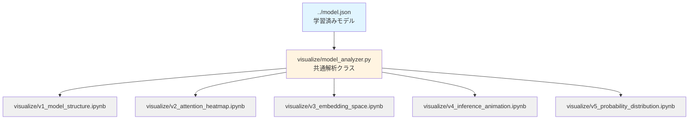
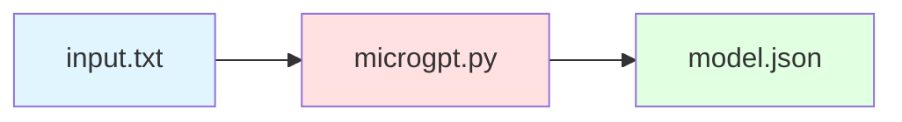
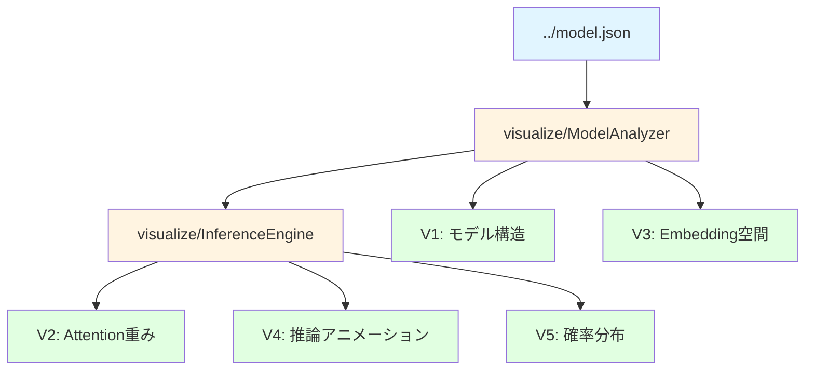

# MicroGPT モデル可視化システム 仕様書

## 1. 概要

本仕様書は、学習済みmicroGPTモデルの内部構造と推論挙動を可視化するシステムの設計を定義する。学習プロセスの可視化は対象外とし、学習済みモデルの重みデータと推論時の挙動に基づく可視化のみを扱う。

すべての可視化コードとNotebookは`visualize/`ディレクトリ配下に配置され、プロジェクトルートの`model.json`を参照する。

### 1.1 対象範囲

- 学習済みモデル（model.json）の読み込みと解析
- モデルパラメータ統計の可視化
- 推論時のAttention機構の挙動可視化
- Embedding空間の構造可視化
- 推論プロセスのアニメーション可視化
- トークン間の条件付き確率分布の可視化

**可視化方針：**
- 静的な統計グラフ：seaborn を優先的に使用（美しく、簡潔）
- インタラクティブ可視化：plotly を優先的に使用（ホバー情報、ズーム、パン）
- グラフ構造：networkx + matplotlib/plotly で可視化
- データ管理：pandas DataFrame で効率的に処理
- 日本語表示：japanize-matplotlib で対応

### 1.2 対象外範囲

- 学習プロセスの可視化（損失曲線、学習進捗など）
- 勾配フローの可視化
- microgpt.pyへの変更（モデル保存機能は既に実装済み）

### 1.3 技術スタック

- Jupyter Notebook形式での可視化
- Python標準ライブラリ + numpy + pandas
- matplotlib + japanize-matplotlib（日本語表示対応）
- seaborn（統計的可視化）
- plotly（インタラクティブ可視化）
- networkx（グラフ構造可視化）
- sklearn（PCA等の機械学習ツール）
- 出力形式：Notebook内でのインタラクティブ表示（PNGファイル出力なし）

## 2. システム構成

### 2.0 環境構築

必要なパッケージのインストール：

```bash
pip install numpy pandas matplotlib seaborn plotly networkx scikit-learn japanize-matplotlib jupyter
```

または requirements.txt を作成：

```
numpy>=1.24.0
pandas>=2.0.0
matplotlib>=3.7.0
seaborn>=0.12.0
plotly>=5.14.0
networkx>=3.0
scikit-learn>=1.2.0
japanize-matplotlib>=1.1.3
jupyter>=1.0.0
```

### 2.1 ファイル構成

```
microgpt.py_analysis/
├── microgpt.py                    # 既存の学習スクリプト（変更なし）
├── model.json                      # 学習済みモデル（microgpt.pyが出力）
├── input.txt                       # 学習データ
├── requirements.txt                # 依存パッケージリスト
├── visualization_spec.md           # 本仕様書
└── visualize/                      # 可視化システム
    ├── __init__.py                 # パッケージ初期化（空ファイル）
    ├── model_analyzer.py           # 共通解析クラス
    ├── v1_model_structure.ipynb    # V1: モデル構造可視化
    ├── v2_attention_heatmap.ipynb  # V2: Attention重みヒートマップ
    ├── v3_embedding_space.ipynb    # V3: Embedding空間分布
    ├── v4_inference_animation.ipynb # V4: 推論アニメーション
    └── v5_probability_distribution.ipynb # V5: 条件付き確率分布
```

**注記：**
- `visualize/__init__.py`は空ファイルで、visualizeをPythonパッケージとして認識させるために必要
- 各NotebookからはPythonの相対インポート不要で、同一ディレクトリの`model_analyzer.py`を直接インポート可能

### 2.2 モジュール関係図



## 3. 共通解析クラス（visualize/model_analyzer.py）

### 3.1 ModelAnalyzer クラス

学習済みモデルを読み込み、各種解析機能を提供するクラス。

#### 3.1.1 初期化処理

- ../model.jsonファイルを読み込む（プロジェクトルートから相対パス）
- 以下の情報を抽出・保持する：
  - config: モデル設定（vocab_size, n_layer, n_embd, block_size, n_head）
  - tokenizer: トークナイザ情報（uchars, BOS）
  - state_dict: 重みデータ（辞書形式、各値は2次元リスト）

#### 3.1.2 提供メソッド

**get_parameter_stats()**
- 各レイヤーのパラメータ数を計算
- パラメータの統計量（平均、標準偏差、最小値、最大値）を計算
- 戻り値：辞書形式の統計情報

**get_embedding_matrix(embedding_type)**
- embedding_type: "token" または "position"
- 対応する埋め込み行列をnumpy配列として返す
- 戻り値：shape=(vocab_size, n_embd) または (block_size, n_embd)

**get_attention_weights(layer_idx)**
- 指定レイヤーのAttention重み行列（wq, wk, wv, wo）を取得
- 戻り値：辞書形式 {"wq": array, "wk": array, "wv": array, "wo": array}

**get_mlp_weights(layer_idx)**
- 指定レイヤーのMLP重み行列（fc1, fc2）を取得
- 戻り値：辞書形式 {"fc1": array, "fc2": array}

**tokenize(text)**
- 文字列をトークンID列に変換
- BOSトークンは含めない（呼び出し側で制御）
- 戻り値：トークンIDのリスト

**detokenize(token_ids)**
- トークンID列を文字列に変換
- BOSトークンは無視
- 戻り値：文字列

**get_phonetic_category(char)**
- 文字の音韻的カテゴリまたはPython記号の詳細カテゴリを取得
- char: 文字（'a', 'b', 'c', ...）または記号
- 戻り値：カテゴリ名（11カテゴリ）
  - 'vowels', 'plosives', 'fricatives', 'sonorants', 'approximants'（音韻的特徴）
  - 'round_brackets', 'square_brackets', 'curly_brackets'（括弧ペア）
  - 'operators', 'delimiters', 'quotes'（Python記号）
  - 'whitespace_other'（空白・その他）
- 実装：以下の分類辞書を使用
  - 母音（vowels）: a, e, i, o, u
  - 破裂音（plosives）: p, b, t, d, k, g
  - 摩擦音（fricatives）: f, v, s, z, h, x
  - 鼻音・流音（sonorants）: m, n, l, r
  - 接近音（approximants）: w, y
  - 丸括弧（round_brackets）: (, )
  - 角括弧（square_brackets）: [, ]
  - 波括弧（curly_brackets）: {, }
  - 演算子（operators）: +, -, *, /, %, =, <, >, &, |, ^, ~, !, @
  - 区切り記号（delimiters）: ,, :, ;, .
  - クォート（quotes）: ', ", `
  - 空白・その他（whitespace_other）: 空白、タブ、改行、BOS等

**get_phonetic_categories_dict()**
- 全トークンに対する音韻的カテゴリ＋Python記号の詳細カテゴリの辞書を返す
- 戻り値：{token_char: category_name} の辞書
- 可視化時の色分けに使用
- **注意点**：対応する括弧（[と]、(と)、{と}）が同じカテゴリに属し、Embedding空間で近い位置にあることを確認するため

### 3.2 InferenceEngine クラス

学習済みモデルを使って推論を実行し、中間状態をキャプチャするクラス。

**重要：推論実装はmicrogpt.pyの実装を参考に、Python標準ライブラリのみを使用する。**
- numpy/pandas等の外部ライブラリは使用しない
- listとfloat型を使ったスカラー演算で実装
- microgpt.pyのlinear(), softmax(), rmsnorm()関数の実装をそのまま流用
- ただし、Value型による自動微分は使用せず、順伝播のみ実装

#### 3.2.1 初期化処理

- ModelAnalyzerインスタンスを受け取る
- state_dictを内部で保持（Value型に変換せず、float型のまま扱う）

#### 3.2.2 推論時の中間状態記録

推論実行時に以下の情報を記録する：

- 各位置でのトークンID
- 各位置での埋め込みベクトル（token_emb + pos_emb）
- 各レイヤー、各ヘッドでのAttention重み（softmax後の確率分布）
- 各レイヤーでのAttention出力
- 各レイヤーでのMLP出力
- 最終的なlogits
- 最終的な確率分布（softmax後）

#### 3.2.3 提供メソッド

**run_inference(input_text, max_length, temperature, record_states=True)**
- input_textをトークン化（BOSから開始）
- 自己回帰的に推論を実行（microgpt.pyの推論ループと同じ実装）
- record_states=Trueの場合、中間状態を記録
- 戻り値：生成されたテキストと、record_states=Trueの場合は中間状態の辞書
- **実装：Python標準ライブラリのみ使用、listとfloat型で演算**

**compute_attention_for_sequence(token_ids)**
- 指定されたトークン列に対してAttention重みを計算
- 全ヘッド、全位置のAttention重みを返す
- **実装：Python標準ライブラリで計算後、numpy配列に変換して返す**
- 戻り値：shape=(n_layer, n_head, seq_len, seq_len)のnumpy配列

**get_token_probabilities(context_token_ids)**
- 指定されたコンテキストに対して次トークンの確率分布を計算
- **実装：Python標準ライブラリで計算後、numpy配列に変換して返す**
- 戻り値：shape=(vocab_size,)のnumpy配列

### 3.3 数値演算関数

**microgpt.pyの実装をそのまま流用する。Python標準ライブラリのみを使用。**

microgpt.pyの以下の関数を参考に、Value型を使わず直接float型で演算する関数群を実装する：

**linear(x, w)**
```python
def linear(x, w):
    return [sum(wi * xi for wi, xi in zip(wo, x)) for wo in w]
```
- 行列積を計算：w @ x
- x: list[float], len=n_in
- w: list[list[float]], shape=(n_out, n_in)
- 戻り値：list[float], len=n_out

**softmax(logits)**
```python
def softmax(logits):
    max_val = max(logits)
    exps = [(val - max_val) for val in logits]
    exps = [math.exp(e) for e in exps]
    total = sum(exps)
    return [e / total for e in exps]
```
- 数値安定版softmaxを計算
- logits: list[float]
- 戻り値：list[float]の確率分布

**rmsnorm(x)**
```python
def rmsnorm(x):
    ms = sum(xi * xi for xi in x) / len(x)
    scale = (ms + 1e-5) ** -0.5
    return [xi * scale for xi in x]
```
- RMS正規化を計算
- x: list[float]
- 戻り値：list[float]

**注記：**
- これらの関数はmicrogpt.pyの実装と完全に同一（Value型の代わりにfloat型を使用）
- Python標準ライブラリ（math, list comprehension）のみで実装
- numpy等の外部ライブラリは一切使用しない

## 4. Notebook可視化仕様

### 4.1 V1: モデル構造可視化（v1_model_structure.ipynb）

#### 4.1.1 目的

学習済みモデルの構造とパラメータ統計を可視化し、モデルの全体像を把握する。

#### 4.1.2 表示内容

**セクション1：モデル設定情報**
- テキスト形式で以下を表示：
  - 語彙サイズ（vocab_size）
  - レイヤー数（n_layer）
  - 埋め込み次元（n_embd）
  - コンテキスト長（block_size）
  - ヘッド数（n_head）
  - ヘッド次元（head_dim = n_embd / n_head）
  - 総パラメータ数

**セクション2：レイヤー別パラメータ数**
- 棒グラフで表示：
  - x軸：各重み行列の名前（wte, wpe, layer0.attn_wq, ...）
  - y軸：パラメータ数（対数スケール）
  - 色分け：埋め込み層、Attention層、MLP層で色を変える

**セクション3：重み行列の統計量**
- pandas DataFrameをテーブル形式で表示：
  - 列：重み行列名、平均、標準偏差、最小値、最大値
  - 各重み行列ごとに1行
  - DataFrame.style.highlight_max()で最大値を強調

**セクション4：モデルアーキテクチャ図**
- Mermaid形式の図をmarkdownセルに記述：
  - 入力トークン → Token Embedding → Position Embedding
  - → RMSNorm → Multi-Head Attention → Residual接続
  - → RMSNorm → MLP → Residual接続
  - → LM Head → 出力確率分布

#### 4.1.3 実装方針

- ModelAnalyzerクラスのget_parameter_stats()を使用
- seaborn.barplotでパラメータ数グラフを作成（色分け機能を活用）
- pandas DataFrameで統計テーブルを作成・表示
- japanize-matplotlibで日本語ラベルを正しく表示

### 4.2 V2: Attention重みヒートマップ（v2_attention_heatmap.ipynb）

#### 4.2.1 目的

推論時のAttention機構の挙動を可視化し、モデルがどのトークンに注目しているかを把握する。

#### 4.2.2 入力パラメータ

- 可視化対象テキスト（例："emma"）
- 表示対象レイヤー（デフォルト：layer 0）
- 表示対象ヘッド（デフォルト：全ヘッド）

#### 4.2.3 表示内容

**セクション1：入力情報**
- 入力テキスト
- トークン化結果（各文字とトークンIDの対応）

**セクション2：全ヘッドのAttention重みヒートマップ**
- サブプロット配置：2x2（4ヘッド分）
- 各ヒートマップ：
  - x軸：Key位置（0, 1, 2, ...）
  - y軸：Query位置（0, 1, 2, ...）
  - 値：Attention重み（0〜1の確率）
  - カラーマップ：viridis
  - 各セルに文字ラベルを表示
  - 対角線より上は因果マスクにより0
- seaborn.heatmapまたはplotly.graph_objects.Heatmapで作成
  - plotly版：ホバーで詳細情報（確率値、トークン）を表示

**セクション3：特定ヘッドの詳細分析**
- 1つのヘッドを選択（最も特徴的なパターンを示すヘッド）
- 大きなヒートマップで表示
- 各位置で最も注目している位置をテキストで解説

#### 4.2.4 実装方針

- InferenceEngine.compute_attention_for_sequence()を使用
- seaborn.heatmapでヒートマップを作成（アノテーション、カラーバー自動設定）
- 因果マスク（上三角部分）はmask引数で制御
- japanize-matplotlibで日本語ラベルを正しく表示

### 4.3 V3: Embedding空間分布（v3_embedding_space.ipynb）

#### 4.3.1 目的

学習済みToken EmbeddingとPosition Embeddingの分布を可視化し、モデルが獲得した表現空間を理解する。特に、文字の音韻的特徴（母音、破裂音、摩擦音など）とPythonで使用される記号の構造的関係がEmbedding空間でどのようにクラスタリングされているかを確認する。

**注記：** microgpt.pyはcharacter-level tokenization（1文字=1トークン）を使用する。音韻的特徴は英字の分類に有効であり、Pythonコードでは記号（括弧、演算子、区切り記号など）が文法的に重要な役割を持つため、記号を詳細に分類する。例えば、[と]、(と)、{と}のような対応する括弧のペアがEmbedding空間で近い位置にあるかを確認することで、モデルが構造的な関係を学習しているかを検証できる。

#### 4.3.2 表示内容

**セクション1：Token Embedding可視化**

**1-1: 2次元投影**
- PCA（主成分分析）で2次元に投影
- 散布図で表示：
  - 各点が1つのトークン（文字）
  - 点のラベルとして文字を表示
  - 色分け：文字の音韻的特徴とPython記号の構造で詳細分類（11カテゴリ）
    - 母音（vowels）: a, e, i, o, u → 赤色系
    - 破裂音（plosives）: p, b, t, d, k, g → 青色系
    - 摩擦音（fricatives）: f, v, s, z, h, x → 緑色系
    - 鼻音・流音（sonorants）: m, n, l, r → 橙色系
    - 接近音（approximants）: w, y → 紫色系
    - 丸括弧（round_brackets）: (, ) → 明るい青色系
    - 角括弧（square_brackets）: [, ] → 明るい緑色系
    - 波括弧（curly_brackets）: {, } → 明るい紫色系
    - 演算子（operators）: +, -, *, /, %, =, <, >, &, |, ^, ~, ! → 濃い赤色系
    - 区切り記号（delimiters）: ,, :, ;, . → 茶色系
    - クォート（quotes）: ', ", ` → ピンク色系
    - 空白・その他（whitespace_other）: 空白、改行、BOS等 → 灰色系
- seaborn.scatterplotまたはplotly.graph_objects.Scatterで作成
  - hue引数またはcolor引数で分類ごとに色分け
  - plotly版：ホバーでトークン名、座標、分類カテゴリを表示、ズーム・パン可能
  - **注目点**：対応する括弧（例：[と]）が埋め込み空間で近い位置にあるか確認

**1-2: 次元別の重み分布**
- 箱ひげ図で表示：
  - x軸：埋め込み次元（0〜15）
  - y軸：各次元の値の分布（全トークンに渡る）

**1-3: トークン間類似度行列**
- コサイン類似度のヒートマップ：
  - x軸、y軸：各トークン（文字）
  - 値：コサイン類似度（-1〜1）
  - カラーマップ：RdBu_r（赤=類似、青=非類似）

**セクション2：Position Embedding可視化**

**2-1: 2次元投影**
- PCAで2次元に投影
- 散布図で表示：
  - 各点が1つの位置（0〜15）
  - 点のラベルとして位置番号を表示
  - 線で位置0→1→2→...と接続

**2-2: 位置別の重み分布**
- 箱ひげ図で表示：
  - x軸：埋め込み次元（0〜15）
  - y軸：各次元の値の分布（全位置に渡る）

#### 4.3.3 実装方針

- ModelAnalyzer.get_embedding_matrix()で埋め込み行列を取得
- sklearn.decomposition.PCAで2次元投影
  - pca = PCA(n_components=2)
  - projected = pca.fit_transform(embedding_matrix)
- **文字の音韻的特徴＋Python記号の詳細分類辞書を作成：**
  ```python
  # 音韻的特徴（英字用）
  phonetic_categories = {
      'vowels': list('aeiouAEIOU'),
      'plosives': list('pbtdkgPBTDKG'),
      'fricatives': list('fvszhxFVSZHX'),
      'sonorants': list('mnlrMNLR'),
      'approximants': list('wyWY'),
  }
  
  # Python記号の詳細分類（構造的関係を反映）
  symbol_categories = {
      'round_brackets': ['(', ')'],      # 丸括弧ペア
      'square_brackets': ['[', ']'],     # 角括弧ペア
      'curly_brackets': ['{', '}'],      # 波括弧ペア
      'operators': ['+', '-', '*', '/', '//', '%', '**', '=', '==', '!=', 
                    '<', '>', '<=', '>=', '&', '|', '^', '~', '!', '@'],
      'delimiters': [',', ':', ';', '.'],  # 区切り記号
      'quotes': ["'", '"', '`'],          # クォート
      'whitespace_other': [' ', '\t', '\n', '\r'],  # 空白文字
  }
  
  # 分類辞書を構築
  char_categories = {}
  for token in analyzer.tokenizer['uchars']:
      # 音韻的特徴をチェック
      if token in phonetic_categories['vowels']:
          char_categories[token] = 'vowels'
      elif token in phonetic_categories['plosives']:
          char_categories[token] = 'plosives'
      elif token in phonetic_categories['fricatives']:
          char_categories[token] = 'fricatives'
      elif token in phonetic_categories['sonorants']:
          char_categories[token] = 'sonorants'
      elif token in phonetic_categories['approximants']:
          char_categories[token] = 'approximants'
      # Python記号をチェック
      elif token in symbol_categories['round_brackets']:
          char_categories[token] = 'round_brackets'
      elif token in symbol_categories['square_brackets']:
          char_categories[token] = 'square_brackets'
      elif token in symbol_categories['curly_brackets']:
          char_categories[token] = 'curly_brackets'
      elif token in symbol_categories['operators']:
          char_categories[token] = 'operators'
      elif token in symbol_categories['delimiters']:
          char_categories[token] = 'delimiters'
      elif token in symbol_categories['quotes']:
          char_categories[token] = 'quotes'
      elif token in symbol_categories['whitespace_other']:
          char_categories[token] = 'whitespace_other'
      else:
          char_categories[token] = 'whitespace_other'  # その他
  
  # BOS等の特殊トークンも追加
  if '<BOS>' in analyzer.tokenizer.get('uchars', []):
      char_categories['<BOS>'] = 'whitespace_other'
  ```
- seaborn color paletteで各カテゴリに色を割り当て
  - 例：カスタムカラーマップを定義（11カテゴリ）
    ```python
    category_colors = {
        'vowels': '#e74c3c',           # 赤色系
        'plosives': '#3498db',         # 青色系
        'fricatives': '#2ecc71',       # 緑色系
        'sonorants': '#e67e22',        # 橙色系
        'approximants': '#9b59b6',     # 紫色系
        'round_brackets': '#5dade2',   # 明るい青色系
        'square_brackets': '#52be80',  # 明るい緑色系
        'curly_brackets': '#af7ac5',   # 明るい紫色系
        'operators': '#c0392b',        # 濃い赤色系
        'delimiters': '#8b4513',       # 茶色系
        'quotes': '#ec7063',           # ピンク色系
        'whitespace_other': '#95a5a6'  # 灰色系
    }
    ```
- コサイン類似度はsklearn.metrics.pairwise.cosine_similarity()で計算
  - **重要**：対応する括弧のペア（例：[と]、(と)）の類似度を特に確認
- seaborn.scatterplotで散布図を作成（hue引数で色分け）
- seaborn.boxplotで箱ひげ図を作成
- seaborn.heatmapでコサイン類似度行列を可視化
- japanize-matplotlibで日本語ラベルを正しく表示
- plotly版では、各点のcustomdataに分類カテゴリを含めてホバーで表示
  - 括弧トークン同士の距離を矢印や線で結ぶなどの視覚化も検討

### 4.4 V4: 推論アニメーション（v4_inference_animation.ipynb）

#### 4.4.1 目的

推論プロセスを時系列アニメーションで可視化し、トークン生成の各ステップでモデル内部がどう動作しているかを理解する。

#### 4.4.2 入力パラメータ

- 開始トークン（デフォルト：BOS）
- 生成トークン数（デフォルト：5）
- 温度パラメータ（デフォルト：0.5）
- アニメーション速度（フレーム間隔、デフォルト：1000ms）

#### 4.4.3 アニメーションフレーム構成

各フレームで以下を表示：

**上段：モデル構造図**
```
[現在のトークン] 
    ↓
[Token Emb] + [Pos Emb]
    ↓
[RMSNorm]
    ↓
[Multi-Head Attention]
  [Head 0] [Head 1] [Head 2] [Head 3]
    ↓
[Residual + RMSNorm]
    ↓
[MLP: FC1→ReLU→FC2]
    ↓
[Residual]
    ↓
[LM Head]
    ↓
[Softmax]
    ↓
[次トークンサンプリング]
```

- 現在処理中のブロックをハイライト表示（枠を太く、色を変える）
- 各ブロックに現在の状態を表示：
  - Token Emb: ベクトルの一部を数値表示
  - Attention: 最も注目しているトークンを表示
  - MLP: 活性化の統計量（平均、最大値）を表示

**下段左：生成済みテキスト**
- これまでに生成されたトークン列を表示
- 現在生成中のトークンを強調表示

**下段右：次トークン確率分布**
- 棒グラフで上位10トークンの確率を表示
- x軸：トークン（文字）
- y軸：確率
- 選択されたトークンを赤色で強調

#### 4.4.4 アニメーション進行

1フレームで1つの主要処理を表示（合計8ステップ/トークン）：
1. トークン入力 + Embedding（Token + Position）
2. Attention準備（RMSNorm + Q/K/V計算）
3. Multi-Head Attention計算（4ヘッド並列表示）
4. Attention結合 + Residual接続
5. MLP準備（RMSNorm）
6. MLP計算（FC1 → ReLU → FC2を1ステップで）
7. Residual接続 + LM Head
8. Softmax + トークンサンプリング

次のトークン生成時は1に戻る。

#### 4.4.5 実装方針

- InferenceEngine.run_inference(record_states=True)で中間状態を記録
- **オプション1（推奨）：** plotly.graph_objectsでインタラクティブアニメーション
  - go.Figure() + frames で各ステップを表現
  - ボタンやスライダーで再生制御
  - ホバーで詳細情報を表示
- **オプション2：** matplotlib.animationで従来型アニメーション
  - 各ブロックをmatplotlib.patches.FancyBboxPatchで描画
  - 通常状態：黒枠、linewidth=1
  - アクティブ状態：青枠、linewidth=3
  - 矢印はmatplotlib.patches.FancyArrowPatchで描画
- テキストはmatplotlib.pyplot.textまたはplotly.annotationsで配置
- ブロック座標は固定レイアウト（縦方向にスタック）
- japanize-matplotlibで日本語ラベルを正しく表示

### 4.5 V5: 条件付き確率分布（v5_probability_distribution.ipynb）

#### 4.5.1 目的

arXiv:2106.07890の観点に基づき、トークン間の条件付き確率関係を可視化し、モデルが学習した統計的構造を理解する。

#### 4.5.2 表示内容

**セクション1：条件付き確率行列**
- ヒートマップで表示：
  - x軸：次トークン（全語彙）
  - y軸：現在トークン（全語彙）
  - 値：P(next_token | current_token)
  - カラーマップ：viridis（暗=低確率、明=高確率）
- 計算方法：
  - 各トークンを単独で入力
  - 次トークンの確率分布を取得
  - 全トークンについて繰り返し、行列を構築

**セクション2：トークン遷移グラフ**
- 有向グラフで表示：
  - ノード：各トークン（文字）
  - エッジ：条件付き確率が閾値以上の遷移
  - エッジの太さ：確率の大きさ
  - エッジのラベル：確率値
- 閾値：0.1（調整可能）
- レイアウト：circular layout

**セクション3：高頻度遷移パターン**
- テーブル形式で表示：
  - 列：現在トークン、次トークン、確率
  - 確率の高い順に上位20件を表示
- 解釈コメント：
  - "e"→"a"の確率が高い理由（例：多くの名前に"ea"が含まれる）

**セクション4：特定コンテキストの次トークン分布**
- 入力例：["al", "em", "jo"]
- 各コンテキストに対して棒グラフで次トークン確率を表示
- x軸：トークン（文字）、上位10件
- y軸：確率
- 複数コンテキストを並べて比較
- plotly.graph_objects.Barでインタラクティブ棒グラフを作成（推奨）
  - ホバーで確率の詳細値を表示
  - ドロップダウンメニューでコンテキストを切り替え
- または seaborn.barplot で静的グラフを作成

#### 4.5.3 実装方針

- InferenceEngine.get_token_probabilities()を使用
- 全語彙に対してループ処理して確率行列を構築（語彙サイズ30程度で約30秒）
- pandas DataFrameで確率行列を管理（行・列ラベル付き）
- seaborn.heatmapでヒートマップ作成（自動カラーバー、アノテーション）
- networkx + matplotlib でトークン遷移グラフを描画：
  - nx.DiGraph()で有向グラフを作成
  - nx.circular_layout()で円周上にノードを配置
  - nx.draw_networkx()でグラフを描画
  - エッジの太さはweight属性で制御
- plotly.graph_objects.Barでインタラクティブな棒グラフを作成（ホバー情報付き）
- japanize-matplotlibで日本語ラベルを正しく表示

## 5. データフロー

### 5.1 学習フェーズ（既存）



### 5.2 可視化フェーズ（本仕様）



## 6. 実装上の制約

### 6.1 依存ライブラリ

以下のライブラリを積極的に使用する：
- json（標準ライブラリ）
- numpy（数値計算基盤）
- pandas（データフレーム、テーブル表示）
- matplotlib（pyplot, animation, patches）+ japanize-matplotlib（日本語表示）
- seaborn（統計的可視化、ヒートマップ、散布図、箱ひげ図）
- plotly（インタラクティブ可視化）
- networkx（グラフ構造の作成・可視化）
- sklearn（PCA、コサイン類似度等）
- typing（標準ライブラリ、型ヒント用）

### 6.2 数値計算

**推論実装（InferenceEngine）：**
- microgpt.pyの実装を参考にPython標準ライブラリのみを使用
- Value型ベースの自動微分は使用しない（順伝播のみ）
- listとfloat型を使ったスカラー演算で実装
- linear(), softmax(), rmsnorm()関数をmicrogpt.pyから流用
- numpy/pandas等の外部ライブラリは使用しない

**可視化・解析処理（ModelAnalyzer、Notebook）：**
- numpy配列で効率的に計算
- pandas DataFrameでデータ管理
- float64精度を使用

**理由：**
- 推論はmicrogpt.pyの実装との整合性を保つため
- 可視化はライブラリの機能を活用して効率的に実装するため

### 6.3 出力形式

- すべての可視化はNotebook内で表示
- PNGやPDFファイルへの保存機能は提供しない
- アニメーションはNotebook内でインタラクティブに再生
- 静止画像の場合はmatplotlib.pyplot.show()で表示

## 7. Notebook実行フロー

### 7.1 各Notebookの構成

すべてのNotebookは以下の構造に従う：

1. タイトルと概要（markdownセル）
2. ライブラリインポート（pythonセル）
   - import japanize_matplotlib  # 日本語表示を有効化
   - import pandas as pd
   - import numpy as np
   - import matplotlib.pyplot as plt
   - import seaborn as sns
   - import plotly.graph_objects as go（必要に応じて）
   - import networkx as nx（必要に応じて）
   - from sklearn.decomposition import PCA（必要に応じて）
   - from sklearn.metrics.pairwise import cosine_similarity（必要に応じて）
   - from model_analyzer import ModelAnalyzer, InferenceEngine  # 同一ディレクトリから
3. ModelAnalyzer/InferenceEngineの初期化（pythonセル）
   - analyzer = ModelAnalyzer('../model.json')  # プロジェクトルートのmodel.jsonを読み込む
4. セクション1〜N：各セクションごとにmarkdownセルで説明 + pythonセルで可視化
5. まとめ（markdownセル）

### 7.2 実行順序

Notebookは独立しており、任意の順序で実行可能。ただし、プロジェクトルートに../model.jsonが存在する必要がある。

**実行方法：**
- Jupyter Notebookをvisualizeディレクトリで起動
- または、各NotebookをJupyterで直接開く

推奨実行順序：
1. V1: モデル構造可視化（全体像の把握）
2. V3: Embedding空間分布（学習済み表現の理解）
3. V2: Attention重みヒートマップ（Attention機構の理解）
4. V4: 推論アニメーション（推論プロセスの理解）
5. V5: 条件付き確率分布（統計的構造の理解）

## 8. エラーハンドリング

### 8.1 model.json不存在

../model.jsonが見つからない場合：
- 明確なエラーメッセージを表示：「model.jsonが見つかりません。プロジェクトルートでmicrogpt.pyを実行してモデルを学習してください。」
- 処理を中断

### 8.2 不正なmodel.json形式

model.jsonの形式が不正な場合：
- 明確なエラーメッセージを表示：「model.jsonの形式が不正です。正しく学習されたモデルファイルを使用してください。」
- 欠損しているキーを具体的に表示
- 処理を中断

### 8.3 数値計算エラー

数値計算中にエラーが発生した場合：
- エラーメッセージを表示
- 可能であれば部分的な結果を表示
- ログに詳細情報を出力

## 9. パフォーマンス考慮事項

### 9.1 計算量

- V5（条件付き確率分布）は全語彙×全語彙の計算が必要
- 語彙サイズが小さい（〜30文字）ため、計算時間は1分以内を想定
- pandas DataFrame で確率行列を効率的に管理
- numpy のベクトル化演算を活用して高速化
- 必要に応じて tqdm で進捗表示を追加

### 9.2 メモリ使用量

- すべての重み行列をメモリに展開
- 16次元埋め込み、1レイヤーのモデルのため、メモリ消費は最小限（< 1MB）
- アニメーションのフレームデータも軽量

## 10. 可視化デザイン原則

- 日本語表示：japanize-matplotlibをインポートして日本語フォントを有効化
- カラーマップ：viridis（デフォルト）、RdBu_r（発散）、seabornのパレット（deep, muted等）
- 強調色：赤（選択）、青（アクティブ）、黒（通常）
- フォント：タイトル14pt Bold、軸ラベル12pt、注釈10pt
- 図サイズ：幅10〜15インチ、高さ6〜10インチ
- seabornのスタイル：sns.set_style("whitegrid")またはsns.set_style("darkgrid")
- すべての軸にラベルを表示、必要に応じて凡例を追加

## 11. ドキュメント

各Notebookのmarkdownセルに以下を記載：

- セクションの目的
- 可視化内容の説明
- 結果の解釈方法
- 注意事項

visualize/model_analyzer.pyには各関数にdocstringを記載：
- 関数の目的
- 引数の説明（型と意味）
- 戻り値の説明（型と意味）
- 使用例

## 12. ディレクトリ作成とNotebook起動

**初回セットアップ：**
```bash
cd /Users/notfolder/Documents/microgpt.py_analysis
mkdir -p visualize
cd visualize
touch __init__.py
```

**Jupyter Notebook起動：**
```bash
cd /Users/notfolder/Documents/microgpt.py_analysis/visualize
jupyter notebook
```

または

```bash
cd /Users/notfolder/Documents/microgpt.py_analysis
jupyter notebook visualize/
```
